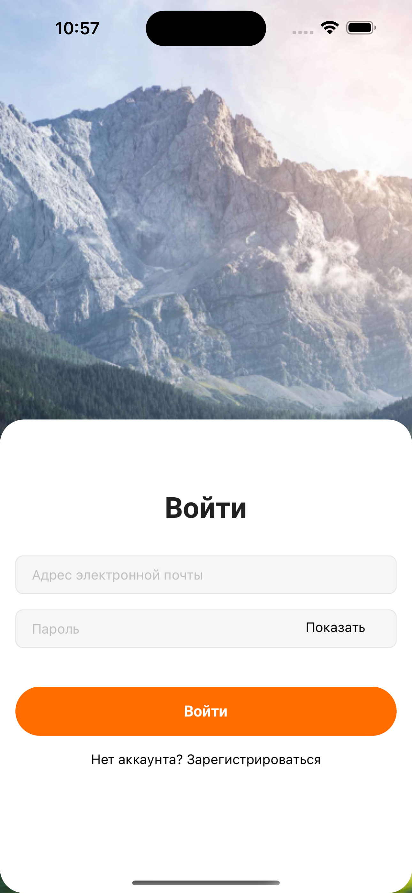
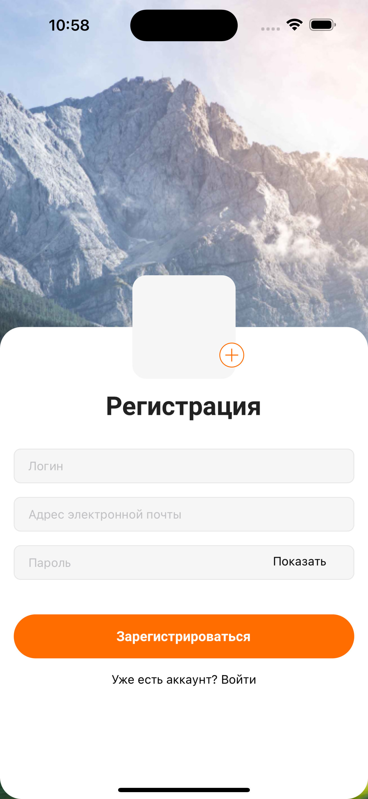
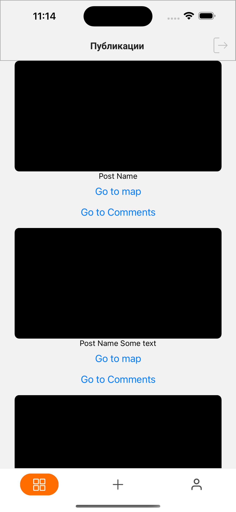
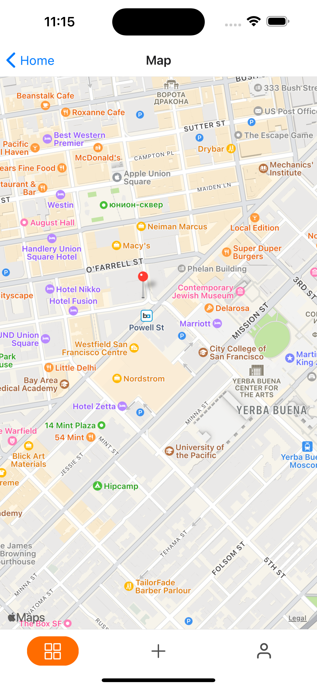
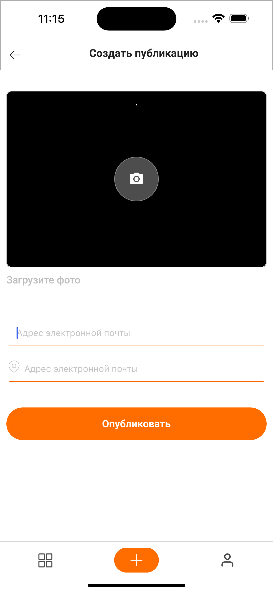
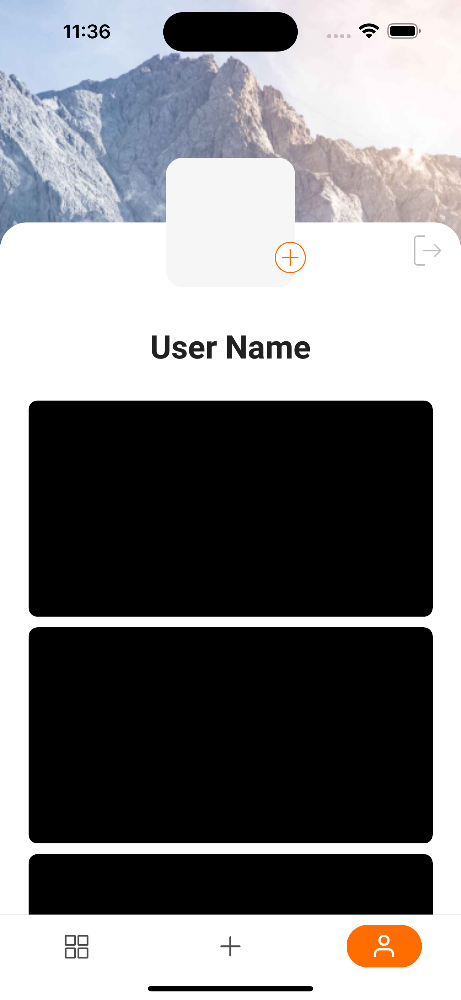
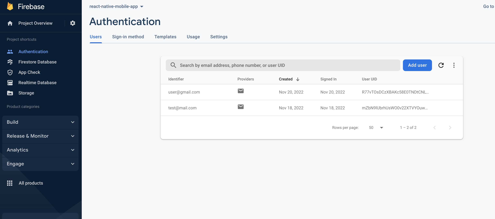
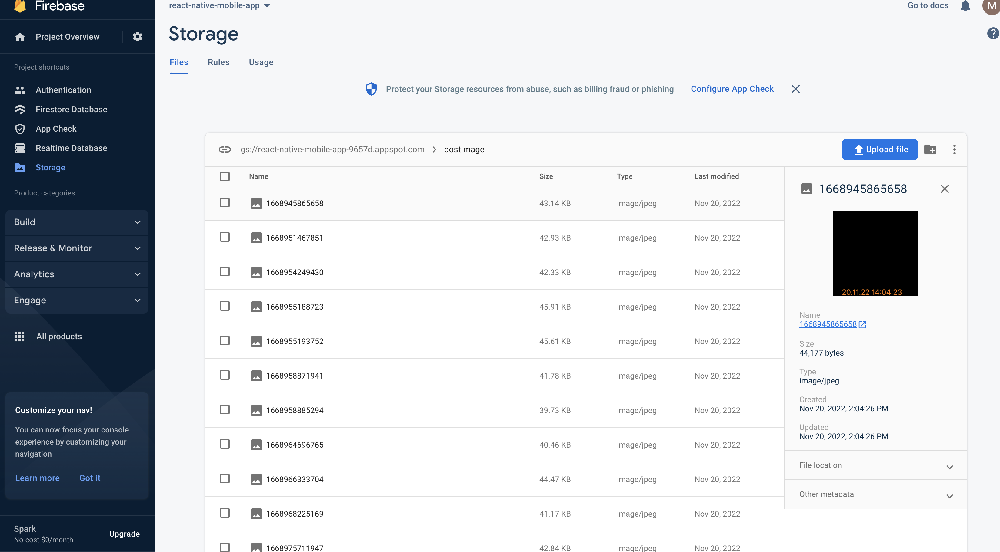

# react-native

1.Подключить камеру в компонент CreatePostsScreen;
2.При открытии экрана CreatePostsScreen активируется камера и изображение из нее выводится в блок с иконкой камеры
3.При клике на иконку камеры делается снимок
4.В инпут с плейсхолдером Название можно добавить название фото
5.В инпут с плейсхолдером Местность можно добавить название где был сделан снимок
6.Добавить определение геолокоции в момент создания поста при клике на кнопку Опубликовать
7.После создания поста должно перенаправлять на экран PostsScreen
8.В компоненте отдельного поста при клике на иконку коментариев перебрасывает на экран CommentsScreen
9.В компоненте отдельного поста при клике на иконку геолокации перебрасывает на экран MapScreen где можно увидеть карту с маркером где была сделана фотография.
10.Подключить Redux в проект
11.Подключить Firebase в проект
12.Добавить логику регистрации на экране RegistrationScreen через методы Firebase
13.Добавить логику логина на экране LoginScreen через методы Firebase
14.Обновить профиль пользователя на Firebase и добавить туда логин в поле displayName после регистрации
15.Сохранять данные о пользователе в Redux после регистрации или логинизации
16.Добавить проверку залогинен ли пользователь в приложении или нет. Если залогинен то сразу перенаправлять на экран PostsScreen иначе - на экран LoginScreen
17.Добавить логику Logout на экране PostsScreen при клике на иконку в хедере используя методы Firebase
18.Добавить логику загрузки постов в базу данных используя Firebase и Redux
19.Добавить логику добавления коментария под постом используя Firebase и Redux

